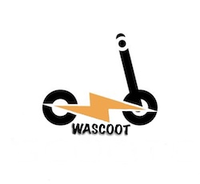

# Wascoot 

WASCOOT is a scooter management web application. It allows the company to keep track of scooters, their locations, and their usage patterns.
The application provides data analytics and reporting features, allowing the company to track usage patterns, measure performance, and make data-driven decisions.
## Group members

| Surname       | Name          | ID       |
| ------------- | ------------- |----------|
| Crivellari	| Alberto	| 2061934	 |
| Gharehzad		| Shiva	| 2043889  |
| Huang	| Borwoei	| 2044019	 |
| kuijpers        | nickclauder	| 2043889	 |
| Mada | Sreeshalini | 2043889  |
| Niknamhesar | Sara | 2043889  |
| Tahan		| Paria		| 2043889	 |
